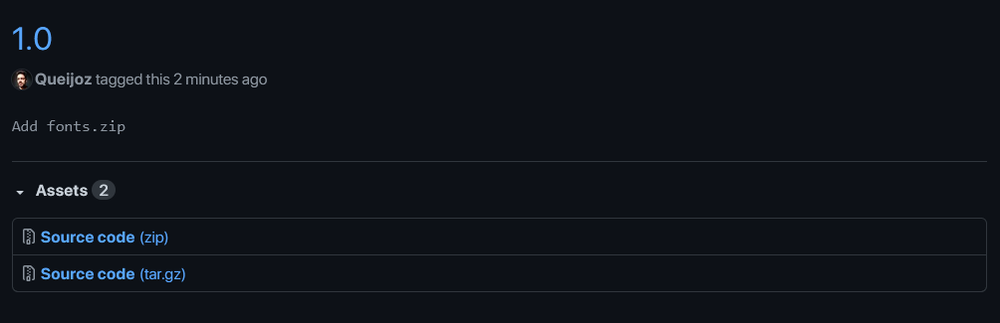
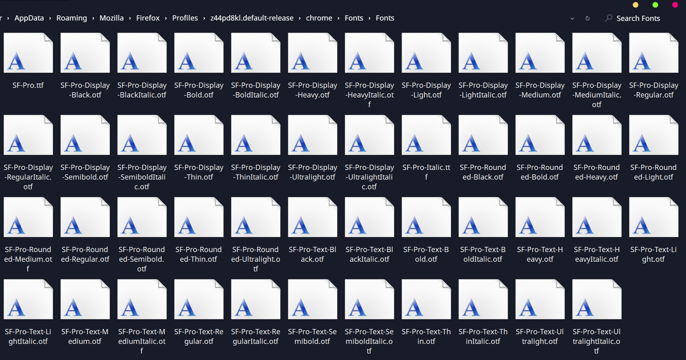
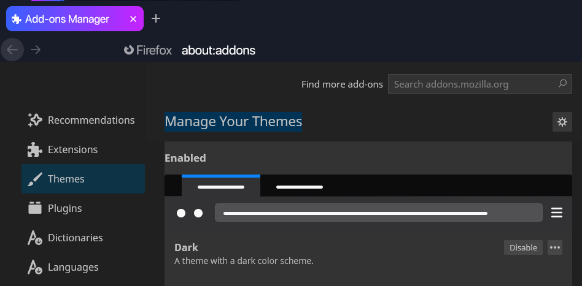
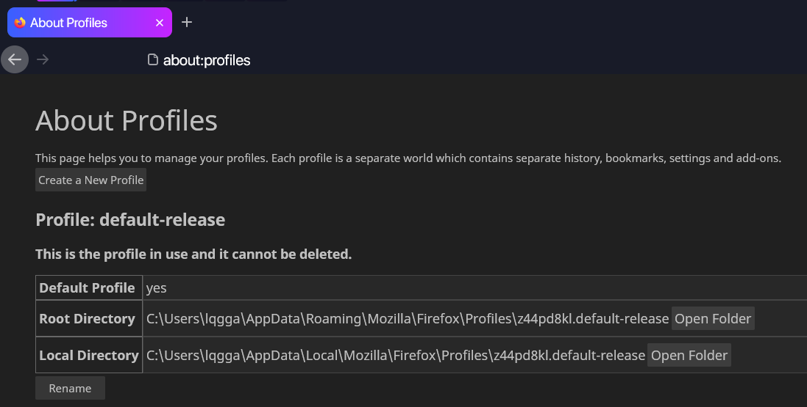
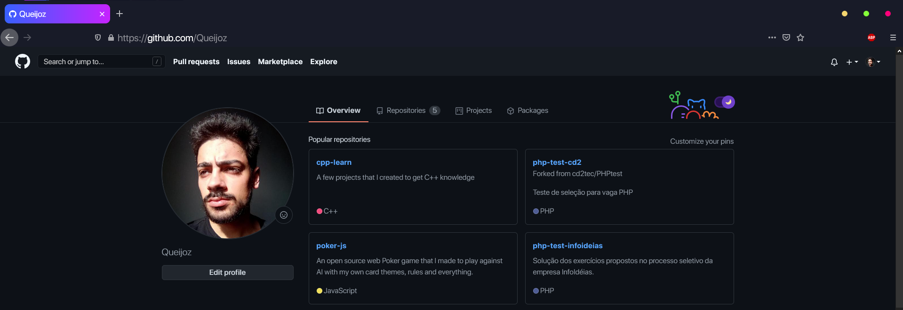

# Installation

1. Download and extract the ``source.zip`` from the last tag.

2. Extract and install ``Fonts.zip``.

3. Type ``about:config`` into firefox address bar.
  - 3.1. Type ``toolkit.legacyUserProfileCustomizations.stylesheets`` in the search box.
  - 3.2. Switch from ``false`` to ``true``.

4. Hit ``Ctrl+Shift+A`` and set firefox dark theme as active.

5. Type ``about:preferences`` inside address bar.
  - 5.1. Make sure to match all values there with the image below.

6. Type ``about:profiles`` in the address bar.
  - 6.1. Open default profile root directory.
  - 6.2. Create a new folder named ``chrome`` if not exist.
  - 6.3. Move the downloaded files (``img``, ``userChrome.css``, ``userContent.css``) to chrome folder.

7. Restart firefox.
